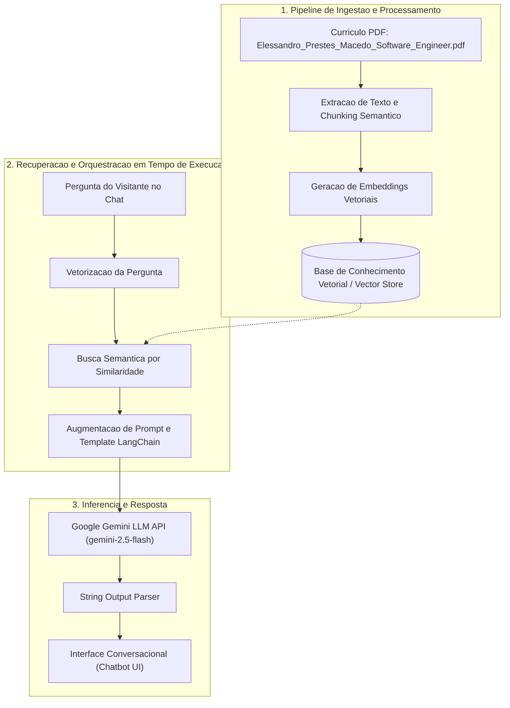

# Portfólio & Currículo Interativo com RAG & LLM | Elessandro Prestes Macedo

[](https://vuejs.org/)
[](https://tailwindcss.com/)
[](https://vitejs.dev/)
[](https://www.langchain.com/)
[](https://ai.google.dev/)
[](https://www.docker.com/)
[](https://www.gnu.org/software/make/)
[](https://elessandroprestes.github.io/elessandrodev/)

---

## 📌 Sobre o Projeto

Este projeto consiste em uma Single Page Application (SPA) de alta performance que serve como portfólio profissional e currículo interativo de **Elessandro Prestes Macedo** (Senior Software Engineer & Tech Lead).

> 🌐 **Deploy em Produção (Live Demo):** [https://elessandroprestes.github.io/elessandrodev/](https://elessandroprestes.github.io/elessandrodev/)

Além de apresentar a trajetória de mais de **9 anos de experiência em engenharia de software e arquiteturas distribuídas**, a aplicação integra um **Assistente Virtual Inteligente** fundamentado no padrão arquitetural **RAG (Retrieval-Augmented Generation)** com **Google Gemini LLM** e **LangChain**, permitindo que recrutadores, clientes e líderes técnicos realizem consultas em linguagem natural com respostas precisas e contextualizadas em tempo real.

---

## 🧠 Arquitetura de IA: Padrão RAG (Retrieval-Augmented Generation)

A aplicação adota o padrão **RAG** para enriquecer o contexto do modelo de linguagem em tempo de execução, garantindo que o assistente responda de forma factual, reduzindo alucinações e fornecendo métricas exatas sobre projetos anteriores (como CAPES, ONS, setor elétrico e automação industrial).



### Principais Pilares da Solução de IA:

1. **Ingestão e Estruturação de Dados do PDF**:
   - Leitura e decomposição hierárquica do currículo técnico em chunks estruturados por empresas, responsabilidades, impacto em métricas (RPS, latência, redução de custos), stack tecnológica e projetos do GitHub.
2. **Base Vetorial e Contextualização (Vector Store / Context Retrieval)**:
   - Indexação do corpus semântico do candidato, permitindo recuperação rápida de informações especializadas com base na relevância semântica da pergunta formulada pelo visitante.
3. **Orquestração de Prompts com LangChain**:
   - Utilização de `@langchain/core` e `@langchain/google-genai` para orquestração de chains determinísticas (`PromptTemplate.pipe(model).pipe(outputParser)`), garantindo sanitização, tom de voz profissional e diretrizes de resposta assertivas.
4. **Chatbot Conversacional em Tempo Real**:
   - Componente reativo em Vue 3 com estado de carregamento otimista, scroll automático, tratamento de exceções e perguntas sugeridas para guiar recrutadores nas principais realizações profissionais.

---

## 🛠️ Stack Tecnológica

| Camada | Tecnologia | Descrição |
|---|---|---|
| **Frontend Framework** | **Vue.js 3** | Composition API, `<script setup>`, reatividade granular |
| **Estilização** | **Tailwind CSS + PostCSS** | Design System responsivo, utilitários atômicos e Glassmorphism |
| **Build & Bundle Tool** | **Vite** | HMR ultrarrápido, otimização de assets e build modular com Rollup |
| **Orquestração de IA** | **LangChain.js** | Cadeias de inferência (Chains), prompts estruturados e parsers |
| **Modelo de Linguagem (LLM)** | **Google Gemini** | Modelo `gemini-2.5-flash` / `gemini-1.5-flash` de alta velocidade e precisão |
| **Padronização de Comandos** | **GNU Make** | Automação unificada de tarefas via `Makefile` |
| **Containerização** | **Docker & Compose** | Ambientes de desenvolvimento e execução isolados e replicáveis |
| **Hospedagem & CI/CD** | **GitHub Pages & Actions** | Deploy automatizado de artefatos estáticos |

---

## ⚙️ Configuração do Ambiente

### 1. Pré-requisitos
- [Docker](https://www.docker.com/) e [Docker Compose](https://docs.docker.com/compose/) **OU** [Node.js (>= 18)](https://nodejs.org/) com [npm](https://www.npmjs.com/).
- [GNU Make](https://www.gnu.org/software/make/) instalado (padrão em sistemas Linux e macOS).
- Uma chave de API do **Google AI Studio** ([Gemini API Key](https://aistudio.google.com/)).

### 2. Variáveis de Ambiente
Copie o arquivo de exemplo e insira sua chave do Google Gemini:

```bash
cp .env.example .env
```

Edite o arquivo `.env`:
```dotenv
# Chave da API do Google Gemini para o assistente de IA conversacional
VITE_GEMINI_API_KEY=sua_chave_gemini_aqui
```

---

## 🚀 Como Executar o Projeto

A automação do ciclo de desenvolvimento e build é gerenciada via **Makefile**.

### Guia Rápido com Makefile

```bash
# 1. Exibir todos os comandos disponíveis
make help

# 2. Configurar o ambiente inicial (cria .env e instala dependências)
make setup

# 3. Executar o ambiente com Docker Compose:
make up

# OU executar localmente no Node/Vite (modo host):
make dev
```

Acesse a aplicação no navegador em: **`http://localhost:5173`** (ou `http://localhost:5173/elessandrodev/`).

---

## 📋 Catálogo de Comandos do Makefile

Execute `make help` a qualquer momento para listar os alvos documentados:

```
Uso: make [alvo]

Alvos disponíveis:

Ajuda
  help                Exibe esta mensagem de ajuda

Configuração & Instalação
  setup               Configura o ambiente inicial (.env a partir do .env.example) e instala dependências
  install             Instala dependências do projeto via npm
  install-clean       Reinstala dependências do zero

Desenvolvimento Local
  dev                 Inicia o servidor de desenvolvimento Vite localmente
  build               Gera o build estático de produção (dist/)
  preview             Visualiza localmente o build de produção
  clean               Limpa a pasta de build gerada (dist/)

Docker & Containers
  up                  Inicia os containers Docker em segundo plano
  down                Para e remove os containers Docker
  restart             Reinicia os containers Docker
  logs                Exibe os logs dos containers em tempo real
  build-docker        Reconstrói as imagens Docker sem cache
  shell               Abre um terminal interativo dentro do container da aplicação
  ps                  Lista o status dos containers Docker do projeto
```

---

## 📦 Build e Deploy

- **Deploy Automático (CI/CD):** Todo push ou merge na branch `main` dispara o pipeline no GitHub Actions e publica automaticamente em:  
  👉 **[https://elessandroprestes.github.io/elessandrodev/](https://elessandroprestes.github.io/elessandrodev/)**

- **Build Manual Local:** Para gerar o pacote estático otimizado para produção localmente:

```bash
make build
```

Os artefatos minificados e otimizados serão gerados no diretório `dist/`, incluindo a versão atualizada do currículo em PDF ([`Elessandro_Prestes_Macedo_Software_Engineer.pdf`](file:///home/elessandro/Área de Trabalho/Dev/Elessandro/elessandrodev/public/Elessandro_Prestes_Macedo_Software_Engineer.pdf)).

---

## 📬 Contato & Redes Profissionais

| Canal | Link |
|---|---|
| **Deploy / Portfólio Online** | [elessandroprestes.github.io/elessandrodev](https://elessandroprestes.github.io/elessandrodev/) |
| **LinkedIn** | [linkedin.com/in/elessandro-prestes-macedo](https://www.linkedin.com/in/elessandro-prestes-macedo/) |
| **GitHub** | [github.com/ElessandroPrestes](https://github.com/ElessandroPrestes) |
| **GitLab** | [gitlab.com/elessandrodev](https://gitlab.com/elessandrodev) |
| **WhatsApp** | [+55 (45) 99917-8290](https://wa.me/5545999178290) |
| **E-mail** | [elessandrodev@gmail.com](mailto:elessandrodev@gmail.com) |

---

<div align="center">
  <sub>Desenvolvido com foco em alta performance, arquitetura limpa e inteligência artificial aplicada por <strong>Elessandro Prestes Macedo</strong>.</sub>
</div>


